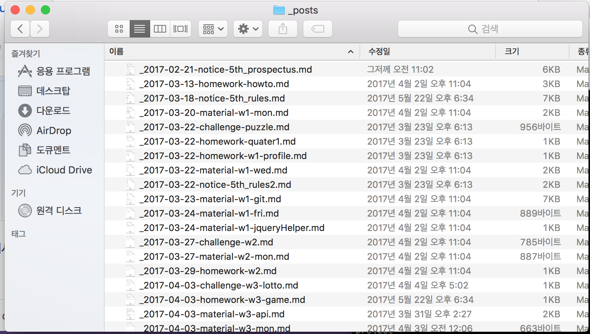

## 건대멋사 페이지 글 올리는 방법

#### 다운로드
```
$ git clone https://github.com/likelionkonkuk/likelionkonkuk.github.io.git
```

#### 제목

```
날짜   -  공지사항(notice)   -  주차(w1)  -  요일 / 제목
		 수업자료(material)
		 과제(homework)
		 챌린지(challenge)
```
```
ex)
20180210-notice-w1-6th_rule.md
20180401-material-w5-thur.md
```

이때 파일은 `_posts` 폴더안에 생성
만약 파일명 앞에 언더바(`_`)를 붙이는 경우에는 페이지에서 안보인다.



#### 마크다운 작성규칙

##### - 태그

|종류|tag|author|winner|mvp|until|
|-----|-----|-----|:-----:|:-----:|:-----:|
|공지사항|notice|건대멋사|X|X|X|
|수업자료|material|각자이름|X|X|X|
|과제|homework|각자이름|X|X|과제제출기한|
|챌린지|challenge|각자이름|팀이름|가장잘한학생|X|


##### - 공지사항 / 수업자료 예제
```
---
title: "건국대학교 멋쟁이사자처럼 5기에 대하여"
tag: notice
author: "건대멋사"
---
```
```
---
title: "7주차 목요일 수업자료(Devise confirmable + Mailgun)"
tag: material
author: "정다혜"
---
```

##### -  챌린지 예제
```
---
title: "3주차 첼린지 : 로또"
tag: challenge
author: "정다혜"
winner: "다혜팀"
mvp: "송지연"
---
```

##### - 과제 예제
```
---
title: "3주차 과제 : 1. 자기소개페이지 2. 신이나를만들때"
tag: homework
author: "정다혜"
until: 2017-04-08
---
```

#### 내용물

- 기본적으로 제목은  위의 tag설정하는 곳에서 `title`에 작성한다.
- 내용물에서 소제목은 `###`(`h3`)로 작성한다.
- 이외의 글은 그냥 작성(`p`)한다.

##### 예제

```markdown
로컬 개발환경 구축을 위해 필요한 프로그램을 다운받고 설치합니다. 튜터의 도움을 받아 설치하여 컴퓨터가 먹통이 되는 일을 방지합시다. 아래 다운로드 링크를 이용하세요!

### 다운로드링크

- [크롬 다운로드](https://www.google.co.kr/chrome/browser/desktop/)
- [서브라임텍스트 다운로드](https://www.google.co.kr/chrome/browser/desktop/)
- [소스트리 다운로드](https://www.sourcetreeapp.com/)

### 윈도우즈 only
- [Rails Installer 다운로드](http://railsinstaller.org/en)
- 윈도우즈담당 튜터의 도움

### 매킨토시 only
- [Iterm2 다운로드](https://www.iterm2.com/)
- 매킨토시담당 튜터의 도움


---

### 유의사항
- 매킨토시 사용자와 윈도우 사용자의 설치파일이 다릅니다.
- **반드시** 담당 튜터의 도움을 받아 설치하도록 합니다.

---

### 참고자료
- [Mackdown Syntax](https://gist.github.com/ihoneymon/652be052a0727ad59601)
- [HTML5TEST](https://html5test.com/)
- [CSS-Trigger](https://csstriggers.com)
- [15 most popular languages used on GitHub](https://octoverse.github.com/)
- [Ruby programs versus Python 3](https://benchmarksgame.alioth.debian.org/u64q/ruby.html)
- [What Programming Language Should a Beginner Learn in 2016?](https://www.codementor.io/learn-programming/beginner-programming-language-job-salary-community)
- [Google Trends](https://trends.google.com/trends/explore?date=all&q=%2Fm%2F0505cl,%2Fm%2F06y_qx)
```

#### footer

```markdown
---

## Author

written by [이름](https://깃헙아이디.github.io).


<a href="https://dh00023.github.io" target="_blank" class="btn btn-black"><i class="fa fa-github fa-lg"></i> Visit on Github Page &rarr;</a>
```


##### 예제

```markdown
---

## Author

written by [정다혜](https://dh00023.github.io).


<a href="https://dh00023.github.io" target="_blank" class="btn btn-black"><i class="fa fa-github fa-lg"></i> Visit on Github Page &rarr;</a>
```

